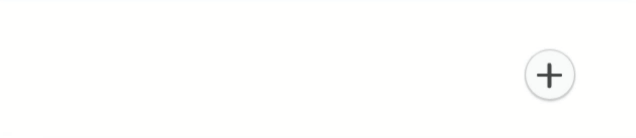

# react-floating-buttons

> A lightweight, customizable and animated ⚛️ react floating buttons

[](https://www.npmjs.com/package/react-floating-buttons) [](https://standardjs.com)

## Install

```bash
npm install --save react-floating-buttons
```

## Usage

```jsx
import React, { Component } from 'react'

import FloatingButtons from 'react-floating-buttons'

import icon1 from  './assets/icon1.svg'
import icon2 from  './assets/icon2.svg'

class Example extends Component {

  this.buttonsList = [
    { onClick: ()=> alert('clicked icon1'), src: icon1 },
    { onClick: ()=> alert('clicked icon2'), src: icon2 },
  ]

  render() {
    return <FloatingButtons buttonType='plus' dimension={50} buttonsList={this.buttonsList}  top={'calc(50% - 25px)'} left={'5%'} direction="right" />
  }
}
```


## Props


##### buttonType

`type: string, isRequired: false, default: 'hamburger'`

​	The toggler button type, accepts: hamburger, plus, vert-dots or hori-dots

##### dimension

`type: number, isRequired: false, default: 40`

​	The buttons dimensions { width, height }

##### top

`type: number | string, isRequired: false, default: 0`

​	The offsetTop position of the toggler button

##### left

`type: number | string, isRequired: false, default: 0`

​	The offsetLeft position of the toggler button

##### backgroundColor

`type:  string, isRequired: false, default: '#f8f9fa'`

​	The toggler button background color

##### buttonColor

`type:  string, isRequired: false, default: '#313131'`	

​	The toggler button color  ( the dots color, the plus color ... )

##### itemBackgroundColor

`type:  string, isRequired: false, default: '#f8f9fa'`

​	The toggler button color  ( the dots color, the plus color ... )

##### direction

`type:  string, isRequired: false, default: 'circular'`

​	The direction of the nav when opened, accepts: left, right, up, down or circular

##### distance

`type:  number, isRequired: false, default: 100`

​	The distance between the toggler button and the buttons, used only with `direction='circular'`

##### degree

`type:  number, isRequired: false, default: 180`

​	The angle of the circle, used only with `direction='circular'`

##### buttonsList

`type:  [{ onClick: () => {}, src: '' }], isRequired: true`

​	The buttons item, a list of object where each object must have: `onClick` function to handle on click button and `src` the source of the icon of that button.


## Examples

To run the exemple you need to:

-   clone this repo: `git clone https://github.com/AM-77/react-floating-buttons.git`
-   inside the react-floating-buttons folder run: `yarn` or `npm i`
-   inside the example folder run: `yarn` or `npm i` then run: `yarn start` or `npm start`


## Screenshots

**circular 360 degree**


**circular down 180 degree**


**circular customizable degree**


**direction right**


**direction left**



**customized background & direction up**


## Contribution

Feel free to raise an [Issue](https://github.com/AM-77/react-floating-buttons/issues) or submit a [PR](https://github.com/AM-77/react-floating-buttons/pulls).

## Copyright and license

Code copyright 2019 AM-77. Code released under [MIT license](https://github.com/AM-77/react-floating-buttonss/blob/master/LICENSE).
